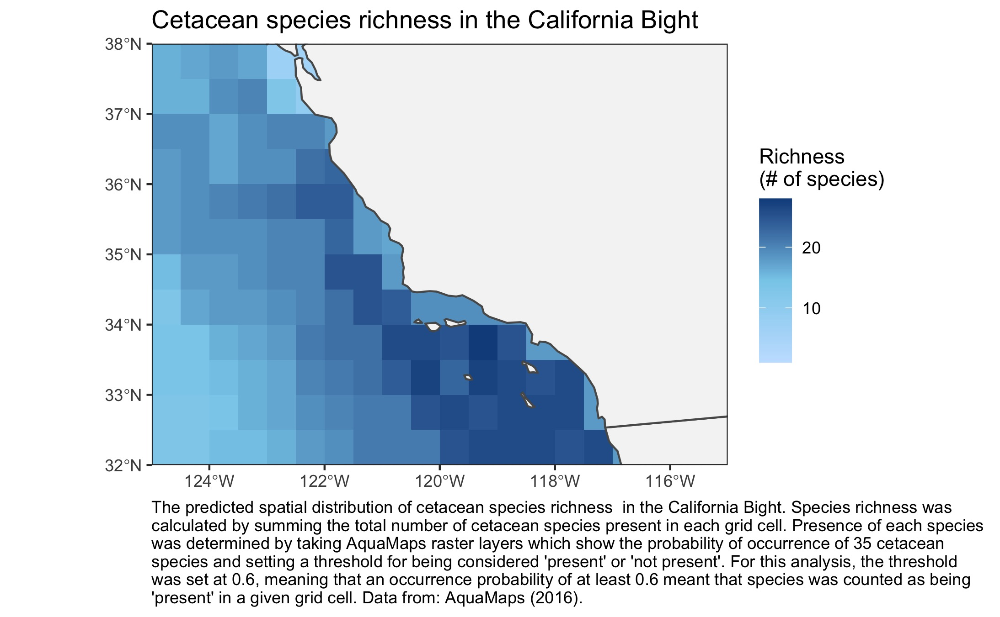

# Spatial Analysis with Rasters in R

```{r setup,echo=FALSE, message=FALSE}


```

**To see my code for producing this plot**, check out my [Github repository](https://github.com/alexehrens/esm244_asst3/tree/main/task2)