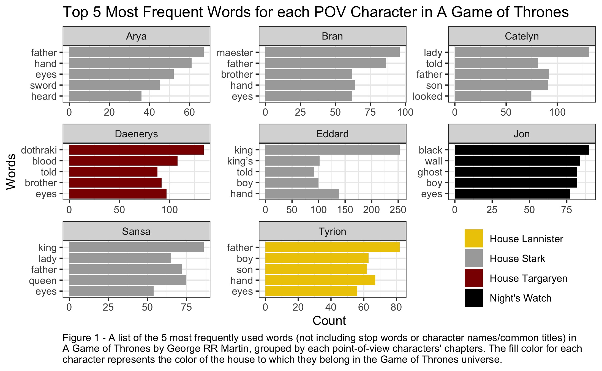
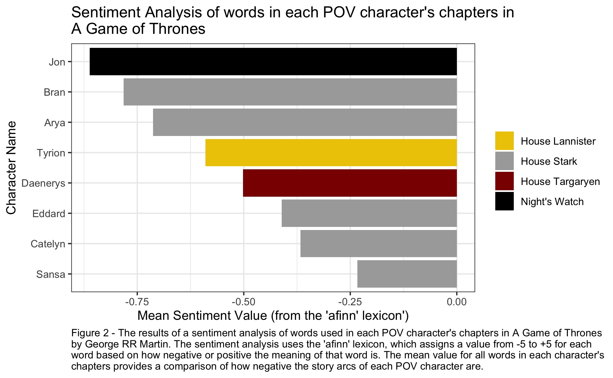

# Text Wrangling and Analysis in R

### Word Frequency by each POV Character's Chapters
```{r,echo=FALSE, message=FALSE}


```

### Sentiment Analysis of Words in each POV Character's Chapters
```{r, echo=FALSE, message=FALSE}

```

**To see my code for producing these plots**, check out my [Github repository](https://github.com/alexehrens/esm244_asst3/tree/main/task3)